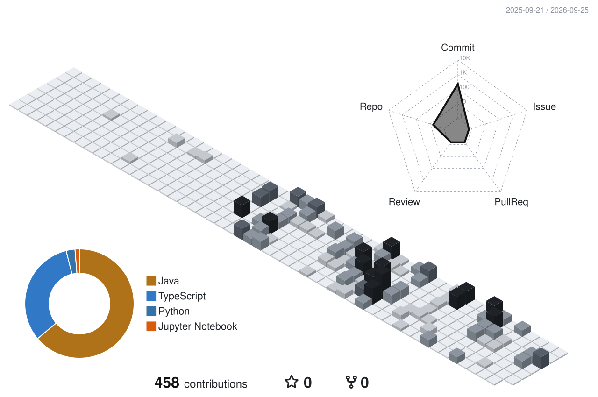

<picture>
  <source media="(prefers-color-scheme: dark)" srcset="assets/hero-dark.svg">
  
</picture>

### About

I'm Vincenzo, an MSc student in Computer Science & Engineering at Politecnico di Milano, on the AI track.
I like taking AI out of the notebook and into the real world: reading human presence in Wi-Fi signals,
or telling mood disorders apart from smartphone reaction times. I have a soft spot for logic and math,
and I love a hard engineering problem.

I also think engineers should keep wide horizons. Away from the keyboard you'll find me into music,
digital art, films, sport and travel.

### Projects

- **[if-i-wi-fi](https://github.com/vincenzoparente04/if-i-wi-fi)**: presence sensing from the Wi-Fi that is already in the room. No cameras, no wearables. 
  `Python` `Arduino UNO Q` `ESP32` · Arduino Hackathon, PoliMi 2026 · [live demo ↗](https://vincenzoparente04.github.io/if-i-wi-fi/)

- **gng-mental-health**: telling bipolar disorder and depression apart from smartphone reaction times. 
  `Python` `scikit-learn` `XGBoost` · paper · repo coming soon

- **cdcl-sat-solver**: a conflict-driven clause-learning SAT solver, written from scratch in C. 
  `C` `fuzzing` `Docker` · 30 cum laude · repo coming soon

- **[se-final-project-mesos](https://github.com/vincenzoparente04/se-final-project-mesos)**: the Mesos board game as a distributed multiplayer app, with lobby, concurrent games and reconnection. 
  `Java` `JavaFX` `Socket & RMI` `MySQL` · 30 cum laude

- **reti-logiche**: a priority task-list manager in hardware, as a 17-state FSM. 
  `VHDL` · repo coming soon

Also: [Tables-Game-Festival](https://github.com/vincenzoparente04/Tables-Game-Festival) (Angular) · [Java-Travel-App](https://github.com/vincenzoparente04/Java-Travel-App) (JavaFX) · [Banks-Data-Science-Project](https://github.com/vincenzoparente04/Banks-Data-Science-Project) (Streamlit)

### Toolbox

<picture>
  <source media="(prefers-color-scheme: dark)" srcset="https://skillicons.dev/icons?i=py%2Cc%2Cjava%2Cts%2Cpytorch%2Csklearn%2Cangular%2Cnodejs%2Cdocker%2Cmysql%2Carduino%2Cgit&theme=dark&perline=12">
  
</picture>

### Activity

<picture>
  <source media="(prefers-color-scheme: dark)" srcset="profile-3d-contrib/profile-dark.svg">
  
</picture>

### Contact

&nbsp;

# vincenzoparente04
