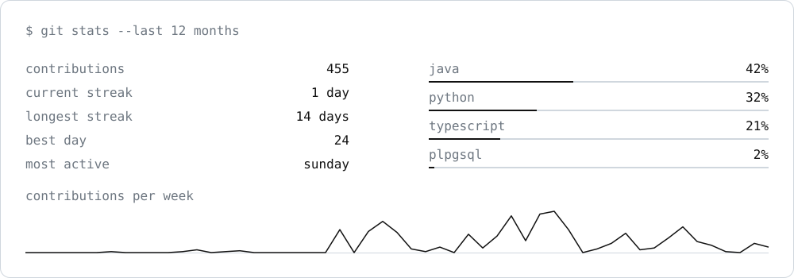

<picture>
  <source media="(prefers-color-scheme: dark)" srcset="assets/tech/header-dark.svg">
  
</picture>

### `~/projects`

- **gng-mental-health**: mood disorders detection from smartphone cognitive tasks · paper
- **[se-final-project-mesos](https://github.com/vincenzoparente04/se-final-project-mesos)**: distributed multiplayer board game in Java 
- **[if-i-wi-fi](https://github.com/vincenzoparente04/if-i-wi-fi)**: presence sensing from the Wi-Fi already in the room · [demo ↗](https://vincenzoparente04.github.io/if-i-wi-fi/)
- **cdcl-sat-solver**: a Conflict-Driven Clause Learning SAT solver in C 
- **digital-logic-network-prj**: a priority task-list manager in VHDL, as a 17-state FSM

<sub> Also: [festa-plan](https://github.com/vincenzoparente04/festa-plan) · [java-sealy-app](https://github.com/vincenzoparente04/java-sealy-app) · [banks-data-science-prj](https://github.com/vincenzoparente04/banks-data-science-prj)</sub>

### `~/stack`

```text
languages   python · c · java · typescript · vhdl · sql
ml / data   pytorch · scikit-learn · xgboost · lightgbm · pandas · numpy
systems     docker · git · arduino · mysql · angular · node.js
```

### `~/stats`

<picture>
  <source media="(prefers-color-scheme: dark)" srcset="assets/tech/stats-dark.svg">
  
</picture>

### `~/contact`

[linkedin](https://www.linkedin.com/in/vincenzo-parente15/) · [email](mailto:vincenzoparente04@gmail.com)
